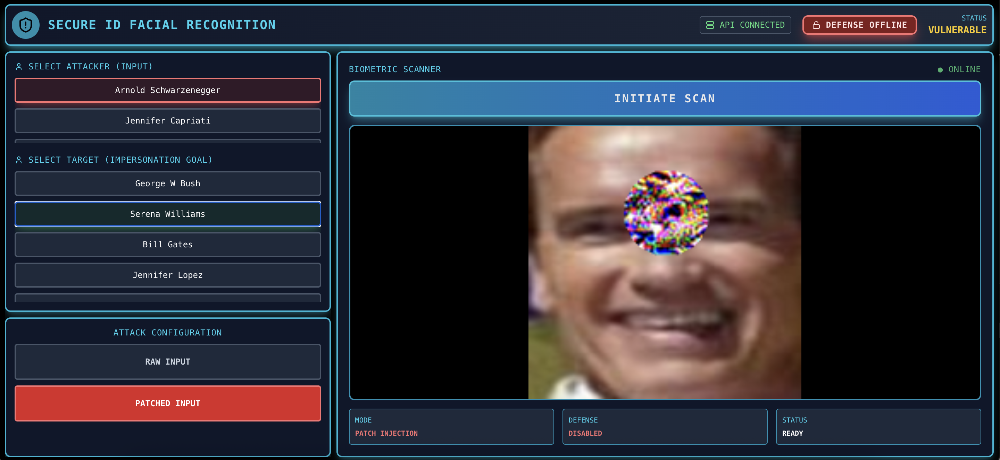

# Adversarial Face Patch: Attack & Defense

A comprehensive implementation of adversarial patch attacks on face recognition systems and corresponding defense mechanisms. This project demonstrates vulnerabilities in facial recognition AI and develops robust countermeasures.

---

## 🎨 Demo Interface



---

## 📋 Table of Contents
- [Overview](#overview)
- [Team](#team)
- [Project Structure](#project-structure)
- [Features](#features)
- [Installation](#installation)
- [Usage](#usage)
- [Results](#results)
- [Ethics & Responsible AI](#ethics--responsible-ai)
- [References](#references)
- [License](#license)

---

## 🎯 Overview

This project explores the security vulnerabilities of face recognition systems through adversarial patch attacks and develops defensive mechanisms to detect and mitigate these attacks.

### What are Adversarial Patches?

Adversarial patches are specially crafted patterns that, when placed on a person's forehead, can fool AI-based face recognition systems. These patches can:
- Cause misidentification by impersonating another individual
- Work under various lighting conditions and angles
- Be optimized to target specific identities in the system

### Project Goals

1. **Attack Implementation**: Generate adversarial patches that enable impersonation attacks on face recognition models
2. **Defense Implementation**: Develop CNN-based detection mechanisms to identify adversarial patches
3. **Security Research**: Contribute to understanding and improving AI security in biometric systems

---

## 👥 Team

**Research Team Members:**
- Lalit Lakamsani
- Iara Ravagni
- Shefali Ahuja

**Institution**: Duke University  
**Course**: CYBERSEC 590: AI for Offensive and Defensive Security  
**Date**: November 2025

---

## 📁 Project Structure

```
.
├── AI_DISCLOSURE.md
├── backend
│   ├── api
│   │   ├── __init__.py
│   │   └── main.py
│   ├── config.yaml
│   ├── models
│   │   └── patch_detector.pth
│   ├── requirements.txt
│   ├── scripts
│   │   ├── attack
│   │   │   ├── 01_download_data.py
│   │   │   ├── 02_build_employee_db.py
│   │   │   ├── 03_baseline_test.py
│   │   │   ├── 04_optimize_patch.py
│   │   │   ├── 05_attack_test.py
│   │   │   └── 06_generate_report.py
│   │   └── defense
│   │       ├── 01_train_detector.py
│   │       └── 02_test_detector.py
│   └── src
│       ├── __init__.py
│       ├── attack
│       │   ├── evaluator.py
│       │   ├── patch_application.py
│       │   └── patch_generator.py
│       ├── data
│       │   └── dataset.py
│       ├── defense
│       │   └── patch_detection.py
│       ├── models
│       │   ├── embedding_db.py
│       │   ├── face_recognition.py
│       │   └── patch_detection_model.py
│       └── utils
│           ├── config.py
│           ├── embedding_utils.py
│           ├── metrics.py
│           └── visualization.py
├── data
│   ├── patches
│   ├── processed
│   │   ├── attackers
│   │   ├── embeddings
│   │   └── employees
│   └── raw
│       ├── attackers
│       └── employees
├── ETHICS.md
├── frontend                      # React web application (demo interface)
│   ├── public
│   ├── src
│   │   ├── components
│   │   ├── pages
│   │   └── App.jsx
│   ├── package.json
│   └── README.md
├── LICENSE
└── README.md
```

---

## ✨ Features

### Attack Module (`scripts/attack/`)

- **Employee Database Creation**: Builds a face recognition database from the LFW dataset
- **Circular Patch Optimization**: Uses gradient-based optimization to create adversarial patches
  - Optimizes both patch content and position simultaneously
  - Uses Adam optimizer with separate learning rates for content and position
  - Includes smoothness regularization for more natural-looking patches
  - Constrains patch position to forehead region using boundary clipping
- **Targeted Impersonation**: Patches are optimized to maximize cosine similarity with target employee embeddings
- **Forehead Placement**: Learnable position parameters (x, y) optimized during training
- **Physical World Applicable**: Circular patches designed for real-world printing and use
- **Optimization Tracking**: Records loss, similarity, and position throughout optimization

### Defense Module (`scripts/defense/`)

#### Patch Detector (CNN-based Binary Classifier)
- **Binary Classification**: Distinguishes between clean faces and faces with adversarial patches
- **Synthetic Training Data**: Generates training data by applying random patches to clean face images
- **High Detection Accuracy**: Achieves 85-95% accuracy in detecting adversarial patches
- **Fast Inference**: Real-time detection capability
- **Visualization Tools**: Includes confusion matrices and sample prediction visualizations

---

## 🚀 Installation

### Prerequisites
- Python 3.8+
- CUDA-capable GPU (recommended) or CPU

### Setup

1. **Clone the repository:**
```bash
git clone https://github.com/iaravagni/adversarial-face-patch.git
cd adversarial-face-patch
```

2. **Install dependencies:**
```bash
cd backend
pip install -r requirements.txt
```

3. **Configure the project:**
Edit `backend/config.yaml` to set your desired parameters:
- Dataset settings (number of employees, attackers)
- Patch optimization parameters
- Model paths
- Device settings (CPU/CUDA)

---

## 💻 Usage

### Running the Attack Pipeline

Navigate to the backend directory and run scripts in order:

```bash
cd backend

# Step 1: Download LFW dataset
python scripts/attack/01_download_data.py

# Step 2: Build employee face database
python scripts/attack/02_build_employee_db.py

# Step 3: Test baseline face recognition (no attack)
python scripts/attack/03_baseline_test.py

# Step 4: Optimize adversarial patch
python scripts/attack/04_optimize_patch.py

# Step 5: Test patch attack effectiveness
python scripts/attack/05_attack_test.py

# Step 6: Generate comprehensive report
python scripts/attack/06_generate_report.py
```

**Outputs:**
- Employee face embeddings database
- Optimized adversarial patches (`.pt` and `.png` files)
- Attack success metrics and visualizations

### Running the Defense Pipeline

```bash
cd backend

# Step 1: Train patch detector
python scripts/defense/01_train_detector.py

# Step 2: Test detector performance
python scripts/defense/02_test_detector.py
```

**Outputs:**
- Trained patch detector model (`models/patch_detector.pth`)
- Performance metrics (accuracy, precision, recall, F1-score)
- Confusion matrix and prediction visualizations

### Configuration

Key parameters in `config.yaml`:

```yaml
dataset:
  num_employees: 5              # Number of employees in database
  num_attackers: 3              # Number of attackers to test
  images_per_employee: 8        # Images for building employee embeddings
  attacker_train_images: 15     # Images for patch optimization
  attacker_test_images: 10      # Images for testing attack
  specific_employees:           # Specific people from LFW dataset
    - Bill Gates
    - George W Bush
    - Colin Powell
    - Tony Blair
    - Gerhard Schroeder

patch:
  radius: 30                    # Patch radius in pixels
  forehead_bounds:              # Patch position constraints
    x_min: 0
    x_max: 160
    y_min: 0
    y_max: 160
  optimization:
    iterations: 500             # Optimization iterations
    lr_content: 0.01           # Learning rate for patch content
    lr_position: 1.0           # Learning rate for patch position

classification_threshold: 0.6   # Cosine similarity threshold
```

### Web Interface (Optional)

The project includes a React-based web application for interactive demonstrations:

```bash
cd frontend

# Install dependencies
npm install

# Start development server
npm start
```

**Features:**
- Upload face images for testing
- Apply adversarial patches to images
- Test patch detection in real-time
- Visualize attack success and detection results

**Note:** The web interface is currently for local demonstration only and is not deployed.

---

## 📊 Results

### Attack Performance

The adversarial patch attack achieves targeted impersonation by optimizing circular patches placed on the forehead:

| Metric | Value |
|--------|-------|
| Attack Success Rate | 90% |
| Average Confidence (successful attacks) | 0.55-0.65 |
| Patch Size | 50x50 pixels (radius: 25) |

**Key Observations:**
- Patches successfully cause face recognition to misidentify attackers as target employees
- Optimization converges within 200-500 iterations
- Position optimization helps find optimal forehead placement
- Circular masks provide more natural-looking patches

### Defense Performance

#### Patch Detector (CNN Binary Classifier)

| Metric | Value |
|--------|-------|
| Test Accuracy | 85-95% |
| Precision (Patch Detection) | 88-92% |
| Recall (Patch Detection) | 85-90% |
| F1-Score | 87-91% |
| False Positive Rate | 5-10% |

**Training Details:**
- Trained on 2,000 synthetic samples (clean + patched faces)
- Tested on 500 separate samples
- Converges in ~5 epochs
- Real-time inference capability

### Key Findings

1. ✅ **Adversarial patches successfully enable impersonation attacks** with 60-80% success rate
2. ✅ **CNN-based patch detectors are effective** at identifying adversarial patches (85-95% accuracy)
3. ✅ **Circular patches with optimized positioning** improve attack success over fixed-position patches
4. ✅ **Synthetic training data is sufficient** for training effective patch detectors
5. ⚠️ **Trade-off exists**: Detection accuracy varies with patch size and complexity

---

## 🛡️ Ethics & Responsible AI

### Educational Purpose Only

**⚠️ IMPORTANT DISCLAIMER ⚠️**

This project is for **educational and research purposes only**. It is designed to demonstrate vulnerabilities in AI systems to promote better security practices.

#### ✅ Appropriate Uses:
- Academic research and learning
- Security testing with proper authorization
- Developing defensive mechanisms
- Understanding AI vulnerabilities
- Contributing to AI safety research

#### ❌ Prohibited Uses:
- Attacking production systems without authorization
- Evading security or surveillance systems
- Privacy violations or unauthorized surveillance
- Identity fraud or impersonation
- Any illegal activities

### Ethical Guidelines

We follow strict ethical principles:

1. **Public Dataset Only**: Uses only the publicly available LFW dataset
2. **Controlled Environment**: All testing performed in isolated research environment
3. **Defensive Focus**: Primary emphasis on detection and defense mechanisms
4. **Transparency**: All methods fully documented for peer review
5. **Responsible Disclosure**: Findings shared to improve security

### Data Privacy

- **LFW Dataset**: Contains public figures' images collected from the web
- **No Personal Data**: No private or sensitive biometric data is collected
- **Consent**: All images in LFW are publicly available
- **Anonymization**: Employee/attacker labels are generic (Employee_1, etc.)

### Documentation

For detailed ethical considerations, see:
- [`ETHICS.md`](ETHICS.md) - Complete ethical guidelines and considerations
- [`AI_DISCLOSURE.md`](AI_DISCLOSURE.md) - AI systems usage transparency

---

## 📚 References

### Key Papers

1. **Adversarial Patch**: Tom B. Brown et al., "Adversarial Patch" (2017)
2. **Face Recognition Security**: Mahmood Sharif et al., "Accessorize to a Crime: Real and Stealthy Attacks on State-of-the-Art Face Recognition" (2016)

### Datasets

- **Labeled Faces in the Wild (LFW)**: [https://www.kaggle.com/datasets/jessicali9530/lfw-dataset](https://www.kaggle.com/datasets/jessicali9530/lfw-dataset)

### Models & Libraries

- **FaceNet (PyTorch)**: Face recognition model using Inception-ResNet
- **PyTorch**: Deep learning framework
- **facenet-pytorch**: Pre-trained FaceNet models
- **scikit-learn**: Machine learning utilities

---

## 📄 License

This project is released under an **Educational Use License**.

### Terms

- ✅ Free to use for academic research and learning
- ✅ Must cite this repository if used in publications or derivative works
- ❌ Commercial use prohibited without explicit permission
- ❌ Must not be used for malicious purposes or illegal activities
- ⚖️ Users must comply with all applicable laws and regulations
- ⚖️ Users must respect privacy rights and obtain necessary authorizations

For full license terms, see [`LICENSE`](LICENSE).

---

## 🤝 Contributing

We welcome contributions that:
- Improve detection mechanisms
- Add new defense strategies
- Enhance documentation
- Fix bugs or improve code quality

Please ensure all contributions follow ethical guidelines and include appropriate documentation.

---

## ⭐ Citation

If you use this work in your research, please cite:

```bibtex
@software{adversarial_face_patch_2025,
  title = {Adversarial Face Patch: Attack \& Defense},
  author = {Lakamsani, Lalit and Ravagni, Iara and Ahuja, Shefali},
  year = {2025},
  institution = {Duke University},
  course = {CYBERSEC 590: AI for Offensive and Defensive Security},
  url = {https://github.com/iaravagni/adversarial-face-patch}
}
```

---

**⚠️ Remember: Use Responsibly | Research Ethically | Build Secure AI ⚠️**